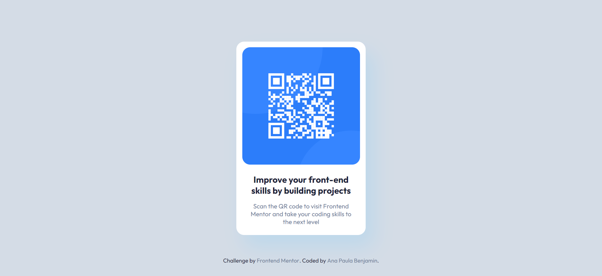

# Frontend Mentor - Solução para o componente de QR code

Esta é uma solução para o desafio do [componente de código QR no Frontend Mentor](https://www.frontendmentor.io/challenges/qr-code-component-iux_sIO_H). Os desafios do Frontend Mentor ajudam a melhorar suas habilidades de codificação construindo projetos realistas.

### Screenshot

### Links

- Solução URL: [Add solution URL here](https://your-solution-url.com)
- Site ao vivo URL: [Add live site URL here](https://your-live-site-url.com)

## Author

- Website - [Ana Paula Benjamin](https://www.your-site.com)
- Frontend Mentor - [@AnaPaulaBenjamin](https://www.frontendmentor.io/profile/AnaPaulaBenjamin)
